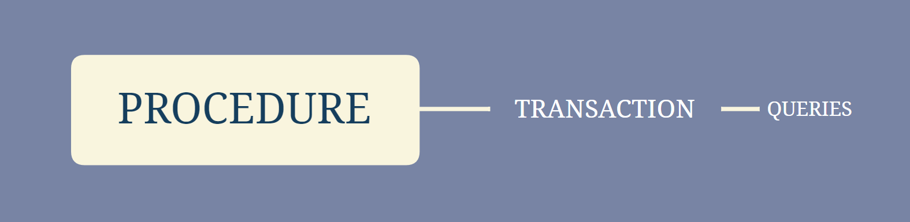

# SQL Grammar

*(mainly in `MySQL`)*

****


## ==DDL==

****

***DEFINE A RELATION AS A TABLE WITH:***

-   ***`schema` (a template of attributes' names)***
-   ***`domains`***
-   ***`integrity constraints`***
-   ***`index`***
-   ***`security & authorization`***
-   ***`storage structure`*** 

***USING:***

-   **`CREATE`**
-   **`ALTER`**
-   **`DROP`**
-   **`TRUNCATE`**
-   **`COMMENT`**
-   **`RENAME`**

***IN THE ORDER OF:***

-   create database: `CREATE DATABASE <database_name> `
-   create referenced tables
-   create referencing tables
-   create index

​		◾◾◾◾◾◾◾◾◾◾◾◾◾◾◾◾◾◾◾◾◾◾◾◾◾◾◾◾◾◾◾◾◾

### *I. Schema/ Domains/ Integrity Constraints*

***`Integrity Constraints`:***

-   **`PRIMARY KEY`**
-   **`FOREIGN KEY`**
-   **`NOT NULL`**
-   **`CHECK`**
-    **`UNIQUE`**
-   (naming) **`CONSTRAINT`** 

>   #### `CREATE TABLE`
>
>   ***'referenced' must be created before 'referencing'***
>
>   ```sql
>   CREATE TABLE <relation_name> (
>         attribute_1 <domain_1>,
>         attribute_2 <domain_2> NOT NULL,
>         attribute_3 <domain_3> CHECK(attribute_3>0),  # check-clause usage 1 (inline)
>         attribute_4 <domain_4> UNIQUE, # unique usage 1 (inline)
>         ...
>         attribute_n <domain_n>,
>         [CONSTRAINT <constraint_name>] PRIMARY KEY(attribute_1),
>         [CONSTRAINT <constraint_name>] FOREIGN KEY(attribute_2) REFERENCES <another_relation_name> ON DELETE SET NULL|CASCADE,
>         [CONSTRAINT <constraint_name>] CHECK(attribute_4 IN (`v1`,`v2`,`v3`)),  # check-clause usage 2 (outline; specifying a enumerated domain)
>         [CONSTRAINT <constraint_name>] UNIQUE(attribute_5, attribute_6, ...),
>         ...
>   )
>   
>   ```
>
>   #### `DROP TABLE`
>
>   ***the whole table is gone!!!!!!!!***
>
>   ```SQL
>   DROP TABLE <relation_name>
>   ```
>
>   #### `ALTER TABLE`
>
>   ***alter attributes & constraints***
>
>   ``` SQL
>   ALTER TABLE <relation_name> ADD|ALTER <attribute_name> <domain>
>   ALTER TABLE <relation_name> DROP <attribute_name>
>   ALTER TABLE <relation_name> DROP CONSTRAINT <constraint_name>
>   ```
>

​		◾◾◾◾◾◾◾◾◾◾◾◾◾◾◾◾◾◾◾◾◾◾◾◾◾◾◾◾◾◾◾◾◾

### *II. Index*

***Uses the Search-key***

***NEED TO SPECIFIY:***

1.  **search-key attributes**
2.  **order**

***TYPES OF INDEX:***

-   Primary Index *(also called Clustering Index; the search-key is usually but not necessary the primary key)*
-   Secondary Index *(also called Non-clustering Index)*
-   Unique Index *(strictly forbid repeating search key => must use super key for search key)*

>   #### `CREATE INDEX`
>
>   ```SQL
>   CREATE [UNIQUE|CLUSTERED|NONCUSTERED|None] INDEX <index_name> ON <relation_name>(attr_i, attr_j, attr_k) ASC|DESC # default is CUSTERED
>   ```
>
>   #### `DROP INDEX`
>
>   ```SQL
>   DROP INDEX <index_name>
>   ```


## ==DML==

****

***MANIPULATE DATA IN TABLE USING:***

-   **`INSERT`**
-   **`UPDATE`**
-   **`DELETE`**
-   **`MERGE`**
-   **`CALL`**
-   **`EXPLAIN PLAN`**
-   **`LOCK TABLE`**

​		◾◾◾◾◾◾◾◾◾◾◾◾◾◾◾◾◾◾◾◾◾◾◾◾◾◾◾◾◾◾◾◾◾

>   #### UPDATES
>
>   -   **`INSERT INTO`**
>   -   **`UPDATE`**
>   -   **`DELETE`**
>
>   ##### `INSERT INTO`
>
>   ***insert data (tuples) to table***
>
>   ***'referenced' must be inserted before 'referencing'***
>
>   ```sql
>   CREATE TABLE <relation_name> (
>   attribute_1 <domain_1>,
>   attribute_2 <domain_2> NOT NULL,
>   attribute_3 <domain_3> CHECK(attribute_3>0),  # check-clause usage 1 (inline)
>   attribute_4 <domain_4>
>   ...
>   attribute_n <domain_n>,
>   PRIMARY KEY(attribute_1),
>   FOREIGN KEY(attribute_2) REFERENCES <another_relation_name> ON DELETE SET NULL,
>   CONSTRAINT <constraint_name> CHECK(attribute_4 IN (`v1`,`v2`,`v3`))  # check-clause usage 2 (specifying a enumerated domain)
>   CHECK(attribute_n>1)  # check-clause usage 3 (outline)
>   )
>   
>   ```
>
>   ```SQL
>   INSERT INTO <relation_name> VALUES <tuple_of_values_of_all_attributes>
>   INSERT INTO <relation_name>(attr_i, attr_j, attr_k) VALUES(v_i, v_j, v_k)  # other attributes will have default values 
>   ```
>
>   ##### `UPDATE`
>
>   ***to change only part of the values in a tuple of a table***
>
>   ***the updates order is important due to the where-condition!!!!!!!!***
>
>   ```sql
>   UPDATE <relation_name>
>   	SET attr_i=<expr1>|NULL|<subquery_1>,
>   	    attr_j=<expr2>|NULL|<subquery_2>,
>   	    ...,
>   	WHERE <predecate> /*using WHERE-clause for condition*/
>   	
>   UPDATE <relation_name>
>   	SET attr_i=CASE 
>   		WHEN <predecate>
>   		THEN <expr1>|NULL|<subquery_1>,
>   		ELSE [WHEN <predecate>]
>   		THEN <expr2>|NULL|<subquery_2>,
>   	    ...
>   	    END; /*using CASE-clause for condition*/
>   ```
>
>   ##### `DELETE`
>
>   ***delete TUPLES from a table***
>
>   ```SQL
>   DELETE FROM <relation_name>  # delete all tuples but reserve the table structure in stored
>   DELETE FROM <relation_name> WHERE ...
>   ```
>
>   #### `UNION, INTERSECT, EXCEPT`
>
>   -   **`UNION`: ∪**
>   -   **`INTERSECT`: ∩**
>   -   **`EXCEPT`: —**   
>
>   ***auto DISTINCT if not using ALL***
>
>   ```sqL
>   (<select_clause_1>) UNION|INTERSECT|EXCEPT [ALL] (<select_clause_2>)
>   ```
>
>   #### `VIEW`
>
>   ***can write DML on VIEWs (External/ User Schema) like on RELATIONs (Logical Schema) after created (Internal/ Physical/ Storage Schema is the way the database files are stored on disk)***
>
>   ***⭐ WILL BE <u>TRANSLATED INTO ACTUAL DML ON THE UNDERLYING RELATION</u> BY DBMS IN LOGICAL MODEL*** ***⚠️ UNLESS in the definition of VIEW:***
>
>   -   ***have GROUP BY or HAVING |***
>   -   ***the translation CANNOT BE UNIQUE (i.e. the SELECT-clause has no expressions or aggregates or DISTINCT but only pure attributes' names or nested SELECT that returns a single value) |*** 
>   -   ***FROM-CLAUSE have more than 1 relation |***
>   -   **some attributes not in SELECT-clause CANNOT is NOT NULL**
>
>   ***also can write queries on VIEWs***
>
>   ***⚠️ `WITH CHECK OPTION` => forces updates to view to follow THE PREDECATE IN WHERE-CLAUSE, and further control the updates on the UNDERLYING RELATION IN FROM-CLAUSE!! Else the updates will be <u>done on the RELATION but cannot be seen through VIEW</u>***
>
>   ***⚠️ Whenever the RELATION is updated, need to rerun the queries to show VIEW***
>
>   ```SQL
>   CREATE VIEW <view_name> AS
>   	SELECT ...
>   	FROM <only_one_underlying_relation_name>
>   	WHERE <predecate>
>   	[WITH CHECK OPTION]
>   ```


## ==Queries==

****

>   #### `SELECT`
>
>   ##### ***collaborate with `WHERE` & `FROM` & `ORDER BY` & `GROUP BY` & subqueries***
>
>   ***execute sequence: `FROM` -> `WHERE` -> `GROUP BY` ->  `HAVING` -> `SELECT` -> `ORDER BY`***
>
>   ***⭐ CAN BE NESTED IN:***
>
>   -   ***FROM-clause***
>   -   ***IN-clause***
>   -   ***⚠️ONLY <u>SCALAR-RETURN SELECT-clause</u> CAN BE NESTED IN SELECT-clause!!*** 
>
>   ```SQL
>   SELECT [DISTINCT|ALL] (attr_i, attr_j, attr_k) FROM <relation_name>  # default = ALL
>   SELECT * FROM <relation_name>
>   SELECT attr_i+10 FROM <relation_name>
>   SELECT attr_i FROM <relation_name> WHERE attr_j>5 AND|OR attr_k=8
>   SELECT attr_i FROM <relation_name> WHERE NOT attr_j<4
>   SELECT attr_i FROM <relation_name> WHERE attr_j BETWEEN 2 AND 7
>   SELECT attr_i FROM <relation_name> WHERE attr_j LIKE '%abc%'  # % means any substring
>   SELECT attr_i FROM <relation_name> WHERE attr_j LIKE '_abc_'  # _ means any character
>   SELECT attr_i FROM <relation_name> WHERE attr_j IN ...
>   SELECT attr_i FROM <relation_name> WHERE EXISTS ...
>   SELECT attr_i FROM <relation_1>, <relation_2>  # the CP of the 2 relations
>   SELECT attr_i FROM <relation_name> ORDER BY attr_j [ASC|DESC]  # default = ASC
>   SELECT attr_i FROM <relation_name> GROUP BY (attr_i, attr_j, attr_k)  # after GROUP BY aggregated function will act on group instead of the whole tuples; SELECTed attributes must appear in GROUP BY or with AGGREGATED FUNC.!!!!!
>   SELECT attr_i FROM <relation_name> GROUP BY (attr_i, attr_j, attr_k) HAVING attr_j<15  # HAVING is usually used after GROUP BY
>   SELECT attr_1, attr_2, 
>   	CASE attr_3
>   		WHEN <VAL_1> THEN <NEW_VAL_1>
>   		WHEN <VAL_2> THEN <NEW_VAL_2>
>   		...
>   	END [AS new_attr_3], attr_4, ...	
>   ```
>
>   ##### ***collaborate with Aggregated Functions***
>
>   ***return a single value***
>
>   ***⚠️ IGNORE AGGREGATED ATTRIBUTES WITH VALUE OF  `NULL` EXCEPT `COUNT(*)` (but may return NULL)!!* **
>
>   ***⚠️ CANNOT BE NESTED!! CAN ONLY BE USED IN <u>SELECT-CLAUSE & HAVING CLAUSE</u>!!***
>
>   ```SQL
>   # ignore NULL
>   SELECT AVG([DISTINCT|ALL] <attribute_name>) FROM <relation_name>  # default = ALL
>   SELECT MIN([DISTINCT|ALL] <attribute_name>) FROM <relation_name>
>   SELECT MAX([DISTINCT|ALL] <attribute_name>) FROM <relation_name>
>   SELECT SUM([DISTINCT|ALL] <attribute_name>) FROM <relation_name>
>   # notice NULL
>   SELECT COUNT([DISTINCT|ALL] <attribute_name>) FROM <relation_name>
>   SELECT COUNT([DISTINCT|ALL] *) FROM <relation_name>  # count the number of tuples in a table
>   ```
>
>   #### `AS`
>
>   ***used to RENAME relations or attributes***
>
>   ```sql
>   SELECT r1.attr_1, r2.attr_2 FROM relation_x AS r1, relation_x AS r2 
>   WHERE r1.attr_1=r2.attr_2  # renaming relations
>   SELECT attr_i xxx_a FROM <relation_name>  # renaming attributes; AS can always be ommited!!
>   ```
>
>   #### **`WITH`**
>
>   ***used to DEFINE TEMPORARY RELATIONs with a NAMEs using AS and SELECT-clauses*** 
>
>   ```sql
>   WITH <relation_name1> (<attibute_names>) AS (
>       SELECT ...
>   ),
>   	<relation_name2> (<attibute_names>) AS (
>       SELECT ...
>   ),
>   ...
>   /*QUERIES USING TEMPORARY RELATIONS*/
>   ```
>
>   #### `JOIN`s
>
>   -   ***NATURAL JOIN:*** **`<relation_name1> NATURAL JOIN <relation_name2>`**
>   -   ***INNER JOIN:*** **`<relation_name1> JOIN <relation_name2> USING (attribute_names)`**
>   -   ***OUTER JOIN:*** **``<relation_name1> JOIN <relation_name2> ON <any_predecate>`** 

 ***⚠️`+|-|*|/` WITH `NULL` IS <u>`NULL`</u> !! `<|>` WITH `NULL` IS <u>`UNKNOWN`</u> !!*** 

***⚠️ `NULL` IS THE LARGEST WITH `ASC|DESC` !!!***


## ==Advanced SQL==

****

### Variable

```sql
DECLARE var <domain> # declare variable
```

```sql
SELECT val INTO var # assign value from table 
FROM tab
```

```SQL
SELECT var = val # assign value
```

```sql
SELECT var # simply show the variable
```

​		◾◾◾◾◾◾◾◾◾◾◾◾◾◾◾◾◾◾◾◾◾◾◾◾◾◾◾◾◾◾◾◾◾

### IF-ELSE

```SQL
IF (var1 =|>|< var2)
	THEN
		/*queries*/
	(ELSE
		/*queries*/)
END IF		
```

​		◾◾◾◾◾◾◾◾◾◾◾◾◾◾◾◾◾◾◾◾◾◾◾◾◾◾◾◾◾◾◾◾◾

### Transaction

-   ***Atomicity***: Managed by the DBMS. The DBMS ensures that all operations within a transaction are treated as a single unit, meaning either all are successfully committed or none are.
-   ***Consistency***: Partially managed by both. The DBMS enforces data integrity constraints such as foreign key constraints, unique constraints, check constraints, etc., to ensure that the database doesn't reach an invalid state. However, ensuring business rule consistency and logical correctness of the transactions often falls on the developer. For example, if a transaction involves transferring money from one account to another, the developer must ensure that the total amount of money remains constant (debit one account, credit the other).
-   ***Isolation***: Managed by the DBMS through transaction isolation levels. The DBMS controls how changes made by one transaction are visible to others and protects against phenomena like dirty reads, non-repeatable reads, and phantom reads. Developers can choose the appropriate isolation level based on the requirements for concurrency and consistency.
-   ***Durability***: Managed by the DBMS. Once a transaction is committed, the DBMS guarantees that the changes are permanently saved and will survive future system or database failures.

***FIVE STATES OF TRANSACTIONS => NOT NECESSARILY ROLLBACK BY DBMS WHEN ERRORS OCCUR (WON'T IF NOT COMMITED) !! => NEED TO HANDLE ERROR USING EXPLICIT `ROLLBACK` !!!***  (see ***Stored Procedure***)

​		◾◾◾◾◾◾◾◾◾◾◾◾◾◾◾◾◾◾◾◾◾◾◾◾◾◾◾◾◾◾◾◾◾

### Functions

***must have returned value***

```SQL
CREATE FUNCTION func_name (param1 <domain1>,
                           param2 <domain2>,
                           <...>) returns <ret_domain>
                begin
                	/*queries, includes `return <ret_val>`*/
                end
```

```sql
CREATE FUNCTION func_name (param1 <domain1>,
                           param2 <domain2>,
                          <...>) returns table(
                              attribute_1 <domain_1>,
  						    attribute_2 <domain_2>,
                              ...
                          ) 
                return table(
                    /*a query*/
                )          
```

​		◾◾◾◾◾◾◾◾◾◾◾◾◾◾◾◾◾◾◾◾◾◾◾◾◾◾◾◾◾◾◾◾◾

### Procedure

-   ***stored as functions to avoid repetition (<u>provides reusability</u>)*** 
-   ***not necessary to have returned value (usually return `@@ERROR` for debug of error control)***
-   ***can be called anywhere else***
-   ***useful when encapsuling transactions cuz trans. <u>provides atomicity</u>***

```SQL
CREATE PROCEDURE proc_name (IN param1 <domain1>,
                            OUT param2 <domain2>,
                            INOUT param3 <domain3>,
                            <...>)
                 begin
                 	/*Explicit control about the input vars using `ROLLBACK` (like the `if-else` control at the start of a function in cpp)*/
                 	IF (param1) ... <RETURN exp1> | <RAISERROR ('EXCEPTION 1',16,1);>
                 	IF (param2) ... <RETURN exp2> | <RAISERROR ('EXCEPTION 2',16,1);>
                 	...
                 	DECLARE ErrorVar INT; /*for error handling to store the built-in @@ERROR because @@ERROR alters at every statement*/
                 	/*queries or transactions with consistency control & error control*/
                 	BEGIN TRANSACTION;
                        /*declare variables to store values in tables for convenient (like the benefit of `WITH` for tables)*/
                        DECLARE var INT;
                        SELECT attribute_name INTO var FROM relation_name WHERE <cond>;
                        /*Do updates on some tables, following each is a ERROR HANDLE using `ROLLBACK`, then return specific values, also control exceptions with specific return values; commit if no problems*/
                        UPDATE...
                        SELECT @ErrorVar = @@ERROR;
                        IF @ErrorVar != 0
                            BEGIN
                                ROLLBACK;
                                RETURN @ErrorVar;
                            END
                        COMMIT;
                 end
```




​		◾◾◾◾◾◾◾◾◾◾◾◾◾◾◾◾◾◾◾◾◾◾◾◾◾◾◾◾◾◾◾◾◾

### Trigger

```SQL
CREATE TRIGGER trig_name BEFORE|AFTER UPDATE|INSERT|DELETE ON tab
	(REFERENCING NEW ROW AS rows_name)
    FOR EACH ROW
    (WHEN (/*condition*/))
    BEGIN (ATOMIC) # NO TRANS. IN TRIGGERS BUT CAN CONTROL ATOMACITY WITH `ATOMIC`!
    	/*DML, maybe with if-else or `SET` or calls etc.*/ 
    	(ROLLBACK) # NO TRANS. IN TRIGGERS BUT CAN CONTROL CONSISTENCY WITH `ROLLBACK`!
    END
    		
```


